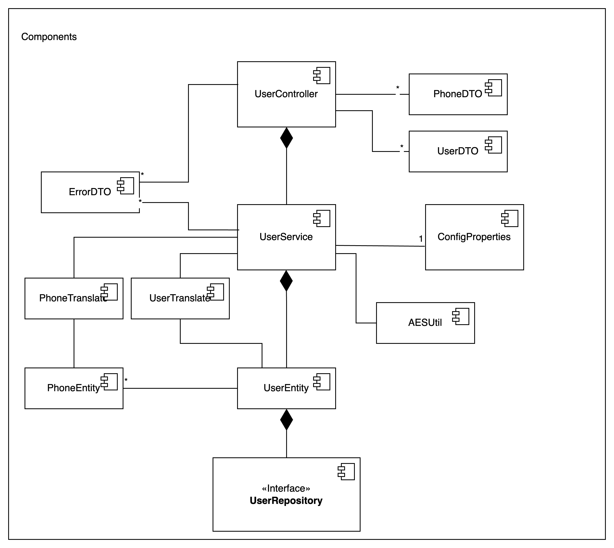
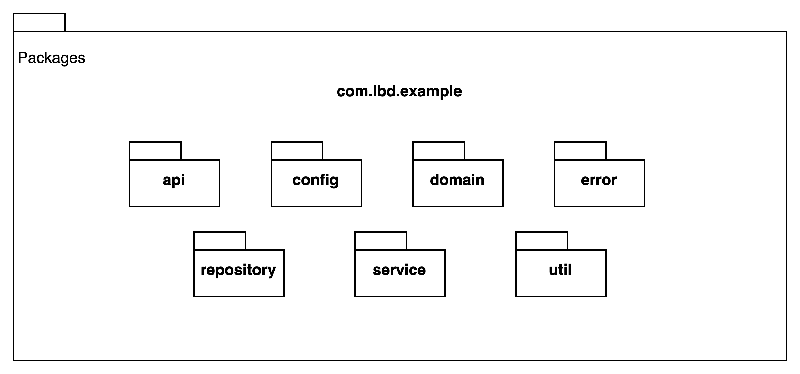
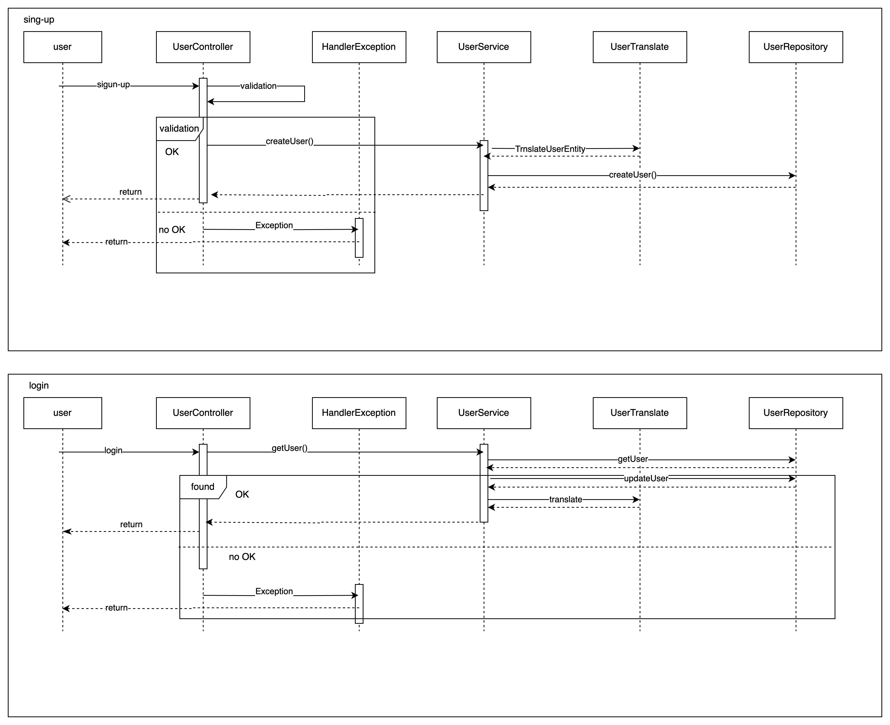

# Getting Started

###  Build
Once you have cloned the project to a local folder, you must run the following command in the root of the project (in my case /demo):

`./gradlew clean build`

When the execution finishes, you should see a folder inside the root of the project called build.

### Coverage Report
The project uses jacoco as a reporter for the coverage of the unit tests.

To see the report you must go to the file:

* `build/jacoc/test/html/index.html`


Where you will find the complete report of unit tests coverage.

It is worth clarifying that the domain, entity and config packages were excluded from the report.


### Run
When the project build finishes, you must go to the /build/libs folder and execute the following command

`java -jar demo-0.0.1-SNAPSHOT.jar`


Th application run on port 8080 and have no profiles to run.


### Test
You can use the postman collection found in the postman folder to test the application.

`postman/DemoTest.postman_collection.json`

the steps to follow are.
1. Import the collection into you r workspace in postman.
2. Ones you have imported the collection, you will see a nee collection called DemoTest.
3. Execute the request called signup, to create the user.
4. Once executed, take the token field from the request response and save it.
5. Execute the request called login, update the value of the authorization header with the token that I saved from the previous step.


# Technical Information
### Assumptions
The project must run on an environment in which Java version 11 is installed.

`java --version`

````
openjdk 11.0.25 2024-10-15
OpenJDK Runtime Environment Homebrew (build 11.0.25+0)
OpenJDK 64-Bit Server VM Homebrew (build 11.0.25+0, mixed mode)
````


### Diagrams





